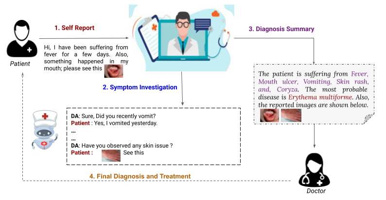
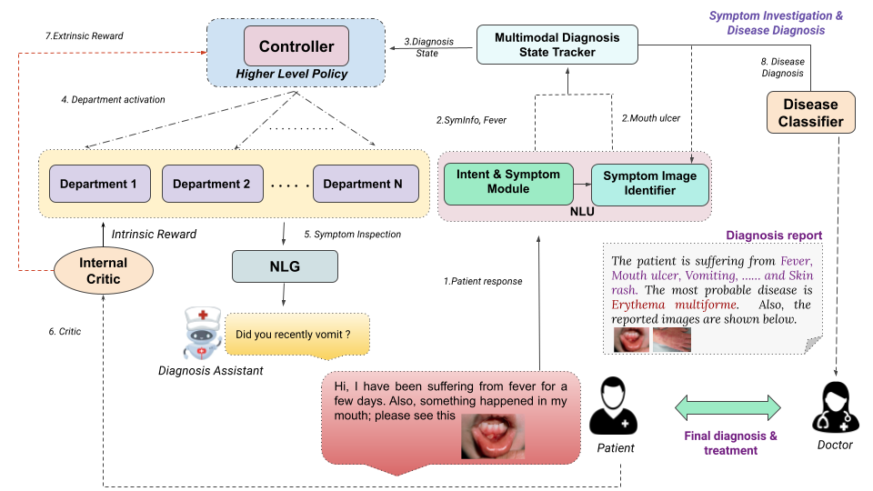
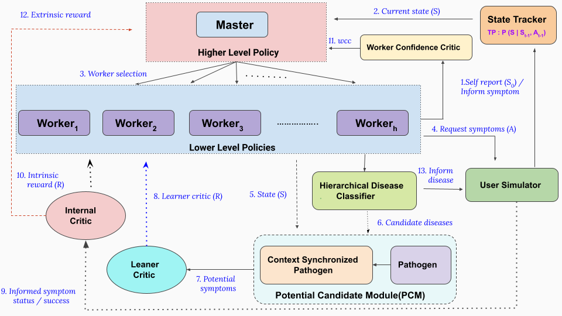
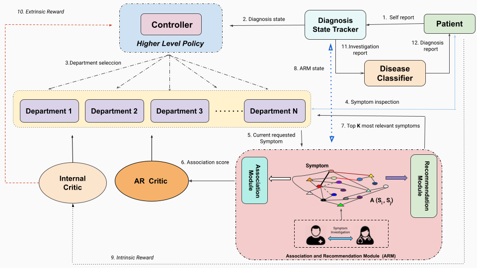
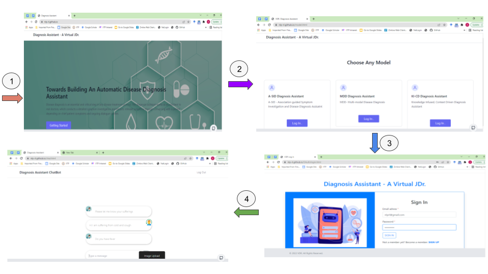
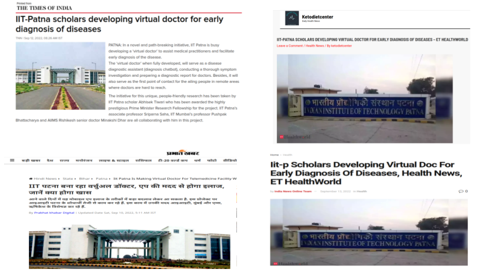

# Virtual Doctor (VDr)

The World Health Organization (WHO, 2016) predicts that there will be more than 14.5 million healthcare workforce shortages by 2030, despite an increase in 40 million health-sector jobs. In addition, the COVID-19 pandemic has wrecked the headway made towards universal health coverage throughout recent years while highlighting existing imbalances in the health sector inside and between nations (WHS, 2021). With the motivation to assist doctors and early diagnosis, we strated developing an automatic disease diagnosis assistant (diagnosis chatbot) named virtual doctor (V Dr.) that conducts a thorough symptom investigation and prepares a diagnosis report for doctors. The assistant acts as a junior doctor that assists a clinician in disease diagnosis task. Additionally, it can serve as the first point of contact in remote areas where doctors are hard to reach.  

* Disease diagnosis is the primary and crucial stage of any medical treatment process.

* The world falls short of 7.2 millions medical workers ==> 30 millions by 2030 

* Most of the countries across the globe  have only 0.01% - 0.1% doctors.

**With the motivation of efficient time utilization of doctors and early diagnosis, we strated to build an AI-assisted virtual assistant for symptomm investigaton and disease diagnosis**

  

I, Abhisek Tiwari, have received the highly regarded Prime Minister Research Fellowship (PMRF) for the project by MHRD, Government of India. The project is mentored by my PhD advisors, Dr. Sriparna Saha (Associate Professor, IIT Patna), and Prof. Pushpak Bhattacharyya (Professor, IIT Bombay). In addition, the project is being supervised and mentored by Dr. Minakshi Dhar (Senior Doctor at AIIMS Rishikesh). Dr. Dhar provides the guidelines for the expected behavior of the AI-based junior doctor and continuously examines the ongoing progress. We have been working on the project since 2021, and we are expecting it to be ready for final screening and deployment by 2023.  

# Main Contributors:
## Abhisek Tiwari  

Research Scolar (PMRF)  
Department of Computer Science and Engineering  
Indian Institute of Technology, Patna, India  
*EmailID*: abhisektiwari2014@gmail.com  
**Website**: https://abhisektiwari.github.io/ 

## Dr Sriparna Saha

Associate Professor   
Department of Computer Science and Engineering  
Indian Institute of Technology, Patna, India  
*EmailID*: sriparna.saha@gmail.com  
**Website**: https://www.iitp.ac.in/~sriparna/  

## Prof Pushpak Bhattacharyya

Professor  
Department of Computer Science and Engineering  
Indian Institute of Technology, Bombay, India  
*EmailID*: pushpakbh@gmail.com  
**Website**: https://www.cse.iitb.ac.in/~pb/ 

## Prof Miankshi Dhar

Professor,  
Department of Internal Medicine  
All India Institute of Medical Science Rishikesh, India  
*EmailID*: @gmail.com  
**Website**: https://medicallearninghub.com/faculty/dr-minakshi-dhar 

# Publications 

### Dr. Can See: Towards a Multi-modal Disease Diagnosis Virtual Assistant  

**Abstract**: Artificial Intelligence-based clinical decision support is logging ever-growing popularity and demands in both the research and industry communities. One such manifestation is automatic disease diagnosis, which aims to assist clinicians in conducting symptom investigation and disease diagnosis. When we consult with doctors, we often report and describe our health conditions with visual aids. Moreover, many people are unacquainted with several symptoms and medical terms, such as mouth ulcer and skin growth. Therefore, visual form of symptom reporting is more of a necessity than an additional feature. However, existing disease diagnosis assistants fail to consider signs/symptoms from visual aid, and they rely solely on symptom information extracted through text responses. Motivated by the efficacy of visual form of symptom reporting, we propose and build a novel end-to-end Multimodal Disease Diagnosis Virtual Assistant (MDD-VA) using reinforcement learning technique. In conversation, users' responses are heavily influenced by the ongoing dialogue context, and multimodal responses appear to be of no difference. We also propose and incorporate a Context-aware Symptom Image Identification module that leverages discourse context in addition to the symptom image for identifying symptoms effectively. Furthermore, we first curate a multimodal conversational medical dialogue corpus in English that is annotated with intent, symptoms, and visual information. The proposed MDD-VA outperforms multiple uni-modal baselines in both automatic and human evaluation, which firmly establishes the critical role of symptom information provided by visuals.  

**Authors**: Abhisek Tiwari, Manisimha Manthena, Sriparna Saha, Pushpak Bhattacharyya, Minakshi Dhar, and Sarbajeet Tiwari  
**Conference**: 31st ACM International Conference on Information and Knowledge Management (CIKM) 2022  
**Link**: https://dl.acm.org/doi/abs/10.1145/3511808.3557296  
**Github**:https://github.com/NLP-RL/DrCanSee

### A Knowledge Infused Context Driven Dialogue Agent for Disease Diagnosis using Hierarchical Reinforcement Learning  
**Abstract**:Disease diagnosis is an essential and critical step in any disease treatment process. Automatic diagnostic testing has gained popularity in recent years due to its scalability, rationality, and efficacy. The major challenges for the diagnosis agent are inevitably large action space (symptoms) and varieties of diseases, which demand either rich domain knowledge or an intelligent learning framework. We propose a novel knowledge-infused context-driven (KI-CD) hierarchical reinforcement learning (HRL) based diagnosis dialogue system, which leverages a bayesian learning-inspired symptom investigation module called potential candidate module (PCM) for aiding context-aware, knowledge grounded symptom investigation. The PCM module serves as a context and knowledge guiding companion for lower-level policies, leveraging current context and disease-symptom knowledge to identify candidate diseases and potential symptoms, and reinforcing the agent for conducting an intelligent and context guided symptom investigation with the information enriched state and an additional critic known as learner critic. The knowledge-guided symptom investigation extracts an adequate set of symptoms for disease identification, whereas the context-aware symptom investigation aspect substantially improves topic (symptom) transition and enhances user experiences. Furthermore, we also propose and incorporate a hierarchical disease classifier (HDC) with the model for alleviating symptom state sparsity issues, which has led to a significant improvement in disease classification accuracy. Experimental results (both quantitatively and qualitatively) on the benchmarked dataset establish the need and efficacy of the proposed framework.  

**Author**: Abhisek Tiwari,Sriparna Saha, Pushpak Bhattacharyya  
**Journal**: Knowledge Based Systems (KBS)  
**Link**: https://www.sciencedirect.com/science/article/pii/S0950705122000971  
**Github**: https://github.com/NLP-RL/KI-CD 

### Symptoms are known by their companies: Towards Association Guided Disease Diagnosis Assistant  

**Abstract**:  Over the last few years, dozens of healthcare surveys have shown a shortage of doctors and an alarming doctor-population ratio. With the motivation of assisting doctors and utilizing their time efficiently, automatic disease diagnosis using artificial intelligence is experiencing an ever-growing demand and popularity. Humans are known by the company they keep; similarly, symptoms also exhibit the association property, i.e., one symptom may strongly suggest another symptom's existence/non-existence, and their association provides crucial information about the suffering condition. The work investigates the role of symptom association in symptom investigation and disease diagnosis process. We propose and build a virtual assistant called Association guided Symptom Investigation and Disease Diagnosis Assistant (A-SIDDA) using hierarchical reinforcement learning. The proposed A-SIDDA converses with patients and extracts signs and symptoms as per patients' chief complaints and ongoing dialogue context. We infused association-based recommendations and critic into the assistant, which reinforces the assistant for conducting context-aware, symptom-association guided symptom investigation. Following the symptom investigation, the assistant diagnoses a disease based on the extracted signs and symptoms. The assistant then diagnoses a disease based on the extracted signs and symptoms. In addition to diagnosis accuracy, the relevance of inspected symptoms is critical to the usefulness of a diagnosis framework. We also propose a novel evaluation metric called Investigation Relevance Score (IReS), which measures the relevance of symptoms inspected during symptom investigation. The obtained improvements (Diagnosis success rate-5.36%, Dialogue length-1.16, Match rate-2.19%, Disease classifier-6.36\%, IReS-0.3501, and Human score-0.66) over state-of-the-art methods firmly establish the crucial role of symptom association that gets uncovered by the virtual agent. Furthermore, we found that the association guided symptom investigation greatly increases human satisfaction, owing to its seamless topic (symptom) transition.  

**Author**: Abhisek Tiwari, Tulika Saha, Sriparna Saha, Pushpak Bhattacharyya, shemim begum, Minakshi Dhar, Sarbajeet Tiwari - 2022, BMC Bioinformatics  
**Journal**: BMC Bioinformatics  
**Link**: https://www.sciencedirect.com/science/article/pii/S0950705122000971  
**Github**:https://github.com/NLP-RL/A-SIDDS

# Platform

**Towards Building An Automatic Disease Diagnosis Assistant**  

  

**website**: https://nlp-rl.github.io/ 

# Media Coverage

  

* **The Times Of India**: https://timesofindia.indiatimes.com/city/patna/iit-p-scholars-developing-virtual-doc-for-early-diagnosis-of-diseases/articleshow/94141545.cms?utm_source=whatsapp&utm_medium=social&utm_campaign=TOIArticleshowicon
* **Prabhat Khabar**: https://www.prabhatkhabar.com/state/bihar/patna/iit-patna-is-making-virtual-doctor-for-telemedicine-facility-will-be-easy-ans
* **Ketodietcenter**: https://www.prabhatkhabar.com/state/bihar/patna/iit-patna-is-making-virtual-doctor-for-telemedicine-facility-will-be-easy-ans
* **India News Online**: https://indianews-online.com/2022/09/12/iit-p-scholars-developing-virtual-doc-for-early-diagnosis-of-diseases-health-news-et-healthworld/

# Support Aknowledgement: 
Abhisek Tiwari would also like to acknowledge the gracious support provided by the PMRF (Prime Minister Research Fellowship, Government of India) grant for conducting the research.
